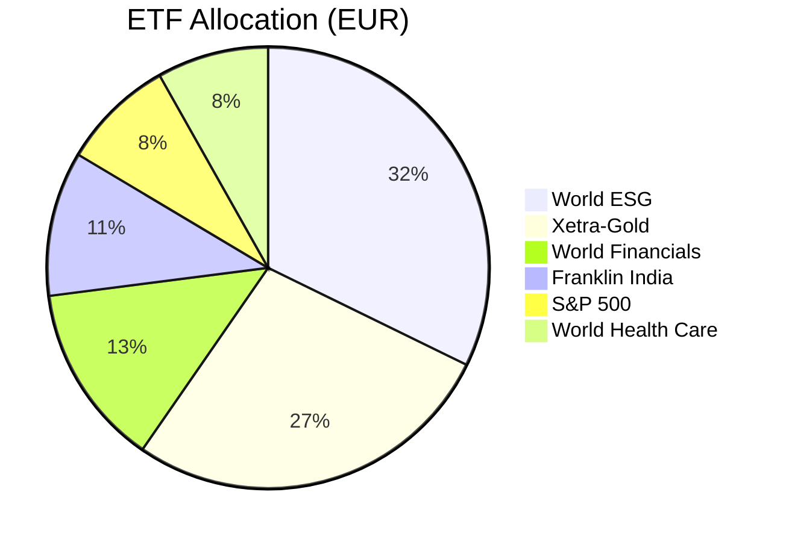

# Global ETF & Broker Portfolio Snapshot
**Date:** April 2, 2026 | **Total Value:** ~58,120 EUR

Below is the verified extraction of your core ETF and broker holdings, utilizing the certified live broker data and reflecting the execution of the 1,700€ monthly savings plan.

## The Core Savings Plan (1,700€ Monthly)

| Ticker / ISIN | Name | Units | Net Value | P/L |
|---------------|------|-------|-----------|-----|
| **IE00BZ02LR44** | Xtrackers MSCI World ESG (900€) | 402.386 | **€16,888.14** | +13.20% |
| **IE00BP3QZ825** | iShares MSCI World Momentum (500€) | 27.8659 | **€2,314.54** | +0.10% |
| **IE00BF4RFH31** | iShares MSCI World Small Cap (300€)| 112.4537| **€911.77** | -2.45% |

---

## Macro Hedge & Broad Market

| Ticker / ISIN | Name | Units | Net Value | P/L |
|---------------|------|-------|-----------|-----|
| **DE000A0S9GB0** | Xetra-Gold (4GLD) | 111.0 | **€14,346.75**| +19.05% |
| **IE00BM67HL84** | Xtrackers World Financials | 197.3329| **€6,988.54** | +9.08% |
| **IE00B3XXRP09** | Vanguard S&P 500 UCITS | 40.2396 | **€4,332.03** | +10.85% |
| **IE00BM67HK77** | Xtrackers World Health Care | 87.2482 | **€4,277.78** | +0.42% |

---

## The Indian Emerging Market Allocation

Given the massive FPI outflows affecting India, this sleeve is currently showing drawdowns, which perfectly validates why you are using INFY in your eToro account as a targeted "safe harbor".

| Ticker / ISIN | Name | Units | Net Value | P/L |
|---------------|------|-------|-----------|-----|
| **IE00BHZRQZ17** | Franklin FTSE India ETF | 165.0 | **€5,552.25** | -17.38% |
| **IE00BZCQB185** | iShares MSCI India ETF | 301.5459| **€2,129.22** | -14.13% |

---

## Speculative / Satellite Holdings

| Ticker / ISIN | Name | Units | Net Value | P/L |
|---------------|------|-------|-----------|-----|
| **DE000TUAG505** | TUI AG | 33.0 | **€221.56** | -78.09% |
| **LU0322250712** | Xtrackers LPX Private Equity | 1.4492 | **€150.83** | -19.33% |
| **IE00BGL86Z12** | iShares EV & Driving Tech | 0.7913 | **€6.62** | +23.34% |

---

## 📊 ETF Portfolio Allocation (Top 6 Holdings)

> [!NOTE]
> Your ongoing accumulation of **IE00BZ02LR44** (World ESG) at 900€ per month correctly establishes it as the dominant anchor of your broader net worth, while **Xetra-Gold** acts as the high-performing secondary pillar stabilizing the high-beta eToro tech plays.
