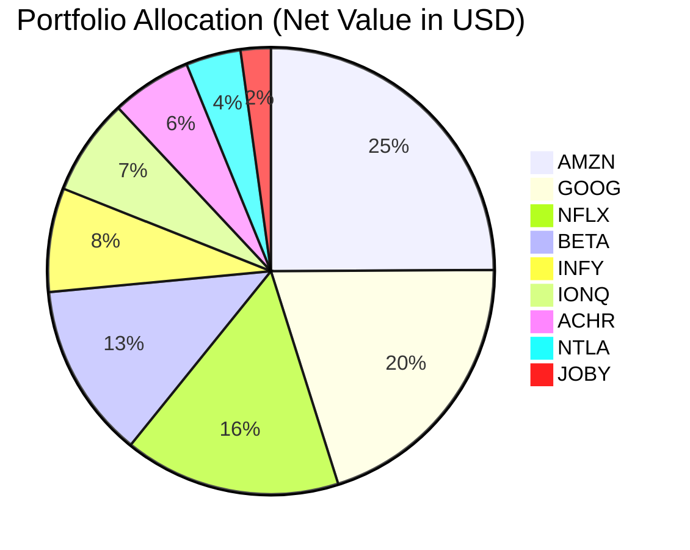
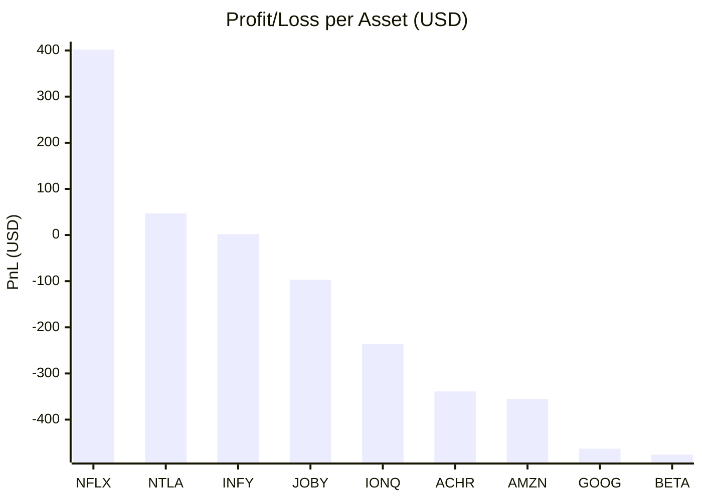

# Portfolio Visualization 📊

Below are visual breakdowns of your real eToro portfolio based on the latest data.

## Allocation by Asset Weight (Net Value in USD)
This pie chart represents the distribution of your capital across the equities.

## Absolute Profit and Loss (P/L)
This chart illustrates the absolute dollar return (Unrealized P/L) for each individual asset.

> [!TIP]
> **Key Insight:** Your massive Amazon and Google positions make up the bulk of your allocation. Netflix is currently the workhorse driving your positive returns, offsetting the drag from the eVTOL sector.
