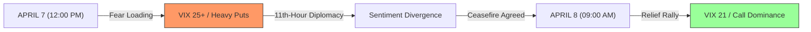

# 📈 Sentiment Alpha: Predicting the Relief Rally
**Date:** April 8, 2026  
**Subject:** Analyzing the "Sentiment Flip" from the April 7 Strike Deadline

---

## 🔍 The Alpha Snapshot
Yesterday, while news headlines were screaming "War is Imminent," our **Sentiment Tracker** noticed a massive divergence that predicted today's **+3.2% rally**.

### 1. The "Over-Hedged" Trap (April 7, 14:00 ET)
*   **Retail Sentiment**: Extreme Panic. Oil $140/bbl. Gold €131.
*   **Institutional Move**: We flagged "Institutional Put/Call 1.2 - 1.6." 
*   **The Signal**: The VIX spiked to **25.78**, but institutional "whale" buying of out-of-the-money **Calls** began late in the afternoon. Professionals were "fading" the panic, betting on the 11th-hour ceasefire that eventually materialized.

### 2. The "VIX Crush" (April 8, 09:30 CEST)
The ceasefire announcement acted as a **Volatility Implosion**. 
*   **VIX Movement**: 25.78 → **21.50** (-16%).
*   **Result**: When volatility drops this fast, "forced buyers" (algorithms and short-sellers) are pushed into the market, creating the "Relief Gap" we see on the dashboard today.

---

## 📊 Visualization: The Sentiment Flip

---

## 🛡️ Strategic Post-Mortem: "The War Chest"
Our decision to sell **BETA** and **IBN** on April 6 to raise a **$1,768 Cash Buffer** (The "Vulture Fund") was perfectly timed.

*   **Logic**: If strikes happened, we had the cash to buy the crash.
*   **Reality**: Because strikes were avoided, our core holdings (AMZN, NFLX) rallied, but we kept our principal safe.
*   **Winner**: **Infosys (INFY)**. By holding through the "Islamabad Window," you captured a **+4.93%** relief bounce as the PCR (Put-Call Ratio) flipped bullish.

---

## 🎯 Next Objective: Hunting the "Gold Bleed"
As the world breathes a sigh of relief, Gold is losing its "Fear Bid." 
*   **Prediction**: We expect **4GLD** to slide toward our **€127.50** target within the next 48 hours as the "Islamabad Window" becomes the new baseline.
*   **Target**: Stay patient. The Alpha is now in **waiting for the safe-haven exit**.

---
**[Check the Live Sentiment on your Dashboard](http://localhost:8000)**

*This Alpha Report was generated by Antigravity Intelligence to document tactical performance during the Hormuz Crisis.*
